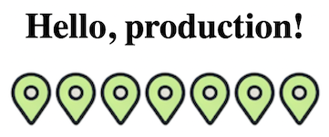

# yandex-maps-ui-kukusik


A demo project for deployment with debian packages. For demonstrantion purposes only.

## [Blog post about deployment with debian packages](https://t.me/tarmolov_work/147)

## Prerequisites
* [Docker](https://www.docker.com/)

## Quick start
### 1. Build docker image
```
$ docker build -t yandex-maps-ui-kukusik .
```

### 2. Run docker container
```
$ docker run --rm -it --privileged -p 8081:8081 -p 8082:8082 -v ${PWD}:/home/app yandex-maps-ui-kukusik
```
After this step you will be entered inside the docker container.

### 3. Build debian package
```
$ debuild --no-lintian -b -uc -us
```

### 4. Install debian package
```
$ dpkg -i ../yandex-maps-ui-kukusik*.deb
```

### 5. Run application
```
$ service nginx restart # apply a new nginx config
$ pm2 start /usr/local/www/app/yandex-maps-ui-kukusik/server/app.js
```

### 6. Check out application
Go to http://127.0.0.1:8081/.
